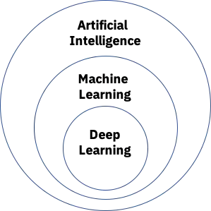
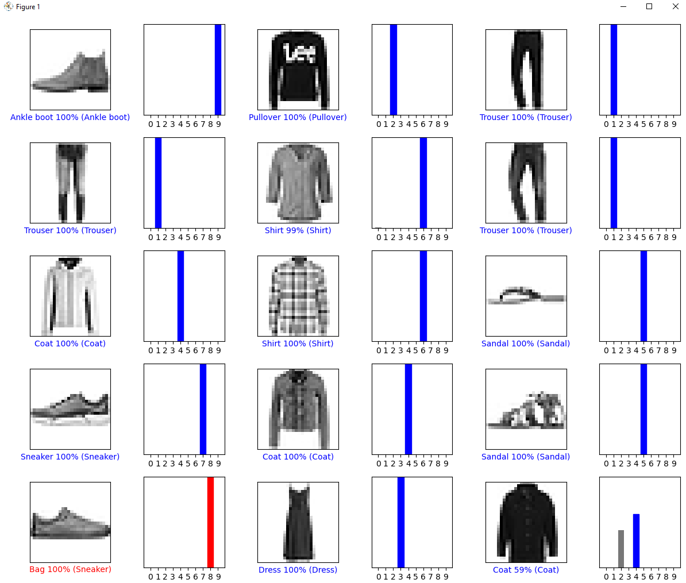

# An overveiw of Artificial Intelligence


Alan Turing was an English Mathematician famous for cracking Nazi codes deemed impossible to crack with the creation of the enigma machine. 

What Makes him such an interesting person and a pioneering figure in A.I is him asking a simple question: "Can machines think?" 

This question is something that has been debated for many decades but at its core is something that A.I has not reached but strives to eventually reach


# Ok... cool you described its history, but what is it?
"Artificial intelligence enables computers and machines to mimic the perception, learning, problem-solving, and decision-making capabilities of the human mind." (sourced the quote from IBM.com)


# `Artificial Intelligence`
Artificial intelligence comes in many forms but generally it covers a whole spectrum of computing technology that shows anything remotely resembling intelligence. This can include anything from a simple npc in a game to the complex expert systems found on the mars rovers
## Simple AI that I made for a homemade video game
All examples shown in tutorial here on out were captured on my computer

```python
    def detect_player(self, player):
        for enemy in self.enemy_list:
            if (math.sqrt(((enemy.center_y - player.center_y))**2 + ((enemy.center_x - 
            player.center_x))**2) < 650): 
                if arcade.has_line_of_sight(player.position, enemy.position, 
                self.map.wall_list):
                    enemy.player_detected = True
                else: 
                    enemy.player_detected = False

    def movement(self, player):
        for enemy in self.enemy_list:
            if enemy.player_detected:
                if enemy.center_y < player.center_y:
                    enemy.center_y += min(ENEMY_SPEED, player.center_y - 
                    enemy.center_y)
                elif enemy.center_y > player.center_y:
                    enemy.center_y -= min(ENEMY_SPEED, enemy.center_y - 
                    player.center_y)
                if enemy.center_x < player.center_x:
                    enemy.center_x += min(ENEMY_SPEED, player.center_x - 
                    enemy.center_x)
                elif enemy.center_x > player.center_x:
                    enemy.center_x -= min(ENEMY_SPEED, enemy.center_x - 
                    player.center_x)
```
- [ <font size="4"> Link to Code</font>](https://github.com/DenverConger/Object-Oriented-Programing-BYUI-Dev-team-5) 
  <br/>
  <br/>
  <br/>
  <br/>
  <br/>
# `Machine Learning`


Is a sub(class?) of AI. It is a computer algorithm that learns by itself. It reprograms itself, as it is given new or more data where it than can perform the specific task it's designed to improve automatically.

An example of this would be last semester we looked at and followed a machine learning algorithm that could predict given a parameter who would survive the titanic sinking or computer vision
  <br/>
  <br/>
  
[ <font size="4"> Predicting the survival of titanic passengers</font>](https://towardsdatascience.com/predicting-the-survival-of-titanic-passengers-30870ccc7e8)
  <br/>
  <br/>

  Custom face tracking A.I I write to make and send coordinated to servo to control them with my face. 
  (And yes this has been done before this is not an original idea)

  
# `Deep Learning`
This is a sub(class?) of machine learning that teaches itself to perform a specific task with increasingly greater accuracy, without human intervention.

**A common example of this is what is called a Neural Network**


 These can be used for detecting which clothing item is which from a photo it is given 

  
   to teaching itself how to play games near perfect


  

# Conclusion
So yeah... A.I is both amazing and versatile


Links to some of the stuff

[ <font size="4"> Markdown Cheat Sheet</font>](https://www.markdownguide.org/cheat-sheet/)

[ <font size="4"> Mario Neural network A.I</font>](https://www.youtube.com/watch?v=qv6UVOQ0F44)

[ <font size="4"> The video game I built for a class (please read the README)</font>](https://github.com/DenverConger/Object-Oriented-Programing-BYUI-Dev-team-5)

 You can also look the rest of this up. there are plenty of recources for all of this
